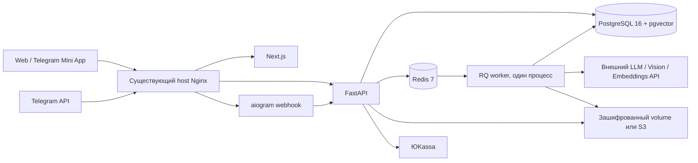

# Neyrix Mama

Русскоязычное Web-приложение и Telegram-бот для хранения данных беременности, обсуждения подтверждённых показателей с AI и подготовки к врачу.

Проект подготовлен для самостоятельного развёртывания. На production-сервер подключения не выполнялись, Nginx не изменялся, webhook бота не переустанавливался.

## Что находится в проекте

```text
neyrix-mama/
  frontend/               Next.js 15, React 19, TypeScript, адаптивный интерфейс
  backend/app/            FastAPI, SQLAlchemy, бизнес-логика, очередь, AI и платежи
  backend/alembic/        Миграция схемы
  backend/knowledge/      Общая база знаний и системный промпт
  backend/tests/          Проверки безопасности и продуктовых сценариев
  frontend/tests/         Браузерные сценарии Playwright
  bot/                    aiogram 3, webhook / development polling
  scripts/                Создание .env, подключение webhook
  nginx/                  Пример конфигурации существующего host Nginx
  docker-compose.yml      Изолированный проект neyrix-mama
  .env.example            Настройки без секретов
```

## Реализованные сценарии

- Демонстрационный dashboard с маркировкой «Демо». Демо-профиль находится только во frontend; seed не создаёт пользователей.
- Google Identity Services: проверка подписи, issuer, audience, срока токена и nonce на сервере. Используется Client ID; для этого способа входа Client Secret не нужен.
- Telegram Mini App: проверка HMAC `initData`, срока 5 минут, получение того же профиля, что и у бота.
- Web → Telegram: одноразовая ссылка на 10 минут, подтверждение в Telegram, затем отдельное подтверждение Telegram ID в авторизованном Web. Два существующих аккаунта автоматически не объединяются.
- Поэтапная анкета, вычисление срока и ПДР, журнал изменений профиля, записи веса, давления, анализов, УЗИ, лекарств, добавок, симптомов, активности и событий.
- Загрузка JPG/JPEG/PNG/HEIC/HEIF/PDF/DOCX/TXT, проверка содержимого и размера, сохранение зашифрованного оригинала, асинхронный разбор, ручная проверка распознанных чисел. Новые сроки из УЗИ не меняют профиль без отдельного подтверждения.
- Общая история AI-чата для Web и Telegram, контекст профиля и подтверждённых измерений, retrieval базы знаний, избранные ответы. Ошибки AI не расходуют лимит; queued/processing-запросы резервируют вопрос.
- Пробный период 30 дней / 5 вопросов в сутки; оплаченный — 20 вопросов. Сброс в 00:00 по Москве. История и данные доступны после завершения периода.
- ЮKassa: создание платежа, проверка статуса через API провайдера, идемпотентное зачисление месяца, сохранённый платёжный метод только при согласии, автопродление, отмена, API возврата. Цена уже согласованного продления фиксируется при оплате.
- Админка `/admin`: статистика, поиск, профиль, выдача 1/3/9 месяцев, лимиты, блокировка, редактирование промпта, моделей, цены, feature flag обслуживания, загрузка/выключение/удаление базы знаний, обращения и журнал действий.
- Настройки напоминаний, еженедельные уведомления, in-app сообщения, обращения в поддержку, экспорт JSON и удаление аккаунта с его данными.

## Архитектура



Redis нужен для долгих задач, общих лимитов и FSM бота. В очереди находятся идентификаторы задач; медицинский payload зашифрован в PostgreSQL. RQ запускает обработчик в дочернем процессе. Worker также проверяет уведомления и платежи. Отдельного AI-микросервиса, локальных моделей, Elasticsearch или Kubernetes нет.

Заданные Compose-лимиты постоянно работающих контейнеров суммарно около 3,25 ГБ. Это верхние лимиты, а не измеренное потребление. Сборку Next.js лучше выполнять заранее: сборочный Node heap ограничен 2 ГБ. На целевом сервере перед запуском проверить фактический запас памяти и место. PostgreSQL и Redis не публикуют порты; Web/API/bot доступны на loopback 3100/8100/8101.

## Схема данных

| Таблица | Назначение |
|---|---|
| users | Зашифрованный профиль беременности, согласие, роль, блокировка, настройки |
| identities | Google `sub` / Telegram ID, уникальность identity и провайдера на пользователя |
| sessions | Только SHA-256 хеш непрозрачного случайного session token, срок 7 дней |
| link_tokens | Хеш одноразовой ссылки и состояние двух подтверждений |
| subscriptions | Период доступа, статус, лимит, согласованный платёжный метод |
| payments | Сумма, provider ID, состояние, согласие на продление |
| chat_messages | Общая история, источники ответа, избранное |
| medical_documents | Metadata, storage key, оригинал вне БД, результат разбора |
| records | Типизированные записи с датой, единицами и provenance |
| profile_changes | Предыдущее/новое значение профиля, источник, кто подтвердил |
| tasks | Асинхронная задача, зашифрованный payload/result, diagnostic ID |
| knowledge_documents / knowledge_chunks | Версии, фрагменты, metadata, embeddings |
| agent_configuration | Редактируемые параметры AI и подписки |
| notifications / support_requests | Уведомления и поддержка |
| audit_logs | События доступа/изменения без медицинских значений |

Все пользовательские сущности связаны с `users.id`; удаление пользователя каскадное. Виды `Record` заменяют отдельные однотипные таблицы WeightRecord, LabResult, Medication и т.д. Сведения о страницах документа хранятся внутри результата извлечения с номером страницы. Это сокращает схему без отдельной копии модели для Telegram.

## Запуск через Docker Compose

Требования: Docker Engine, Compose, доступ к registry. Команды ниже предназначены для инженера развёртывания; они не были выполнены на вашем сервере.

1. Скопировать проект в отдельный каталог, например `/opt/neyrix-mama`.
2. Если `.env` ещё нет: `python3 scripts/init-env.py`. Скрипт создаёт случайные секреты и не перезаписывает существующий файл.
3. Заполнить `.env`; установить права `chmod 600 .env`. Не печатать его содержимое в логи и не добавлять в Git.
4. Для HTTPS-установки задать `ENVIRONMENT=production`, `APP_URL=https://mama.neyrix-ai.ru`. Сохранить `DATABASE_URL` с собственным паролем этого проекта, внутренние адреса сервисов и `STORAGE_DIR=/data/files`.
5. Задать Telegram, Google и AI параметры. Для оплаты — параметры ЮKassa.
6. Проверить `docker compose config --quiet` (не печатает раскрытые env значения).
7. Выполнить `docker compose build`, затем `docker compose up -d`. Сервис `migrate` выполняет Alembic и seed до запуска API/worker.
8. Проверить `docker compose ps` и `curl http://127.0.0.1:8100/api/health`.
9. Инженер вручную адаптирует `nginx/mama.neyrix-ai.ru.conf`, сертификаты и свободные loopback-порты, проверяет `nginx -t`, затем применяет конфигурацию по принятому процессу.
10. Только после проверки HTTPS подключить webhook отдельной командой ниже.

Первая миграция включает `CREATE EXTENSION IF NOT EXISTS vector`. Для выделенного PostgreSQL проект использует образ `pgvector/pgvector:pg16`. Миграционный пользователь должен иметь право создать расширение. В следующей итерации эксплуатации можно разделить роли миграций и приложения.

Для development без Docker:

```bash
python3.12 -m venv .venv
.venv/bin/pip install -r backend/requirements.lock
cd backend
# Передать DATABASE_URL, REDIS_URL, STORAGE_DIR для локальных сервисов.
../.venv/bin/alembic upgrade head
../.venv/bin/python -m app.seed
../.venv/bin/uvicorn app.main:app --reload --port 8000
```

В отдельных терминалах из `backend`: `../.venv/bin/python -m app.worker`; из `frontend`: `npm ci && npm run dev`. Для локальной SQLite допустим `DATABASE_URL=sqlite:///./dev.db`; production использует PostgreSQL. Redis должен быть доступен: без него лимитирование закрывает операции, требующие защиты, а не пропускает запросы бесконтрольно.

## Google

1. В Google Cloud создать OAuth client типа **Web application** и настроить OAuth consent screen.
2. Добавить Authorized JavaScript origins: `https://mama.neyrix-ai.ru`; для локальной разработки отдельно `http://localhost:3000`.
3. Поместить Client ID в `GOOGLE_CLIENT_ID` на сервере. Это публичный идентификатор, который API передаёт виджету Google.
4. Этот вариант использует Google ID token callback, не server authorization-code exchange. Client Secret и redirect URI обмена кода не используются.
5. Для закрытого consent screen добавить тестовых пользователей. Проверить вход реальным аккаунтом на разрешённом origin.
6. Для администратора задать устойчивый Google `sub` в `ADMIN_GOOGLE_SUBJECTS` (через запятую). `sub` можно взять из `identities` после первого входа. Не назначать администратора по одному совпадению email.

Официальное основание: [Google — Verify the Google ID token](https://developers.google.com/identity/gsi/web/guides/verify-google-id-token).

## Telegram

`TELEGRAM_BOT_TOKEN`, `TELEGRAM_BOT_USERNAME`, `TELEGRAM_WEBHOOK_SECRET`, `BOT_INTERNAL_SECRET` находятся только в `.env` сервера. В frontend bundle токена нет.

Production: `BOT_MODE=webhook`. Бот слушает `/telegram/webhook` на 8001, проверяет `X-Telegram-Bot-Api-Secret-Token`. В BotFather настроить домен/Mini App для `https://mama.neyrix-ai.ru`; пользователь открывает приложение из WebApp-кнопки меню бота.

После запуска HTTPS инженер может выполнить:

```bash
# Скрипт запускается внутри backend-контейнера, где доступны env, без печати токена.
docker compose exec -T backend python - < scripts/telegram-webhook.py
```

Скрипт не удаляет накопившиеся updates. Настройка webhook — внешнее изменение; выполнять её только для этой подготовленной установки. Существующий webhook в ходе разработки не менялся.

Development polling запускается отдельно с `BOT_MODE=polling`; предварительно инженер должен явно удалить webhook для тестового бота. Redis lock на хеш токена исключает второй polling-процесс; lock продлевается во время работы. Для разработки предпочтителен отдельный тестовый бот. Webhook и polling одновременно не запускать.

Официальное основание: [Telegram — Validating data received via the Mini App](https://core.telegram.org/bots/webapps#validating-data-received-via-the-mini-app).

## AI, документы и база знаний

В `.env`:

```text
LLM_BASE_URL=https://<выбранный-провайдер>/<префикс-api>
LLM_API_KEY=<ключ>
LLM_MODEL=<основная-модель>
VISION_MODEL=<модель-с-изображениями-и-json>
EMBEDDING_MODEL=<необязательно>
```

Адаптер использует совместимый HTTP-контракт `chat/completions` и, опционально, `embeddings`. Поставщик должен поддерживать JSON object output и сообщения с image_url. Проверьте этот контракт на выбранных моделях. Пустая настройка не имитирует AI-ответ: задача завершится понятной ошибкой без расхода вопроса.

Первый seed импортирует подготовленный системный промпт и Knowledge Base. Из общего медицинского контекста убраны персональные данные из исходных материалов: рост 160 см, исходный вес 64 кг и предположения о тренировочном опыте не применяются ко всем пользователям. Оригинальные прикреплённые файлы остаются вне проекта приложения.

По умолчанию используется лёгкий поиск по фрагментам с metadata. При заданном embedding API индексация получает векторы, а PostgreSQL/pgvector дополняет поиск косинусным сходством. Для небольшого справочника векторы хранятся как JSON и приводятся к vector при запросе; это полный поиск, без ANN-индекса. При росте базы следует мигрировать на типизированную vector-колонку и HNSW, не меняя пользовательский API.

Обновления: `/admin` → «База знаний» → загрузить MD/TXT/PDF/DOCX → дождаться индексации → выключить старую версию. Системный промпт и модели редактируются в «AI и подписка». Для новой версии базы предпочтительно отдельное имя документа; seed не перезаписывает существующую админскую конфигурацию.

Веб-поиск свежих клинических рекомендаций пока не подключён. Ассистенту запрещено утверждать, что он выполнил онлайн-проверку; для лекарств, дозировок, вакцинации и других динамических вопросов он должен направлять к актуальным официальным источникам и врачу. Дата клинической сверки в исходном справочнике — сведения автора файла, не независимая экспертиза разработчика.

Ограничения парсеров: 15 МБ, не более 40 страниц PDF с текстом, 12 страниц сканированного PDF, ограничение размера изображения и распакованного DOCX. Очень большие документы нужно разделять. PDF обрабатывается полностью в пределах этих лимитов; лишние страницы молча не отбрасываются.

## ЮKassa

1. Подключить магазин, карты РФ и разрешённые рекуррентные платежи в кабинете ЮKassa.
2. Заполнить `YOOKASSA_SHOP_ID`, `YOOKASSA_SECRET`, сначала тестовыми значениями.
3. Подключить уведомления `payment.succeeded`, `payment.canceled` на `https://mama.neyrix-ai.ru/api/payments/webhook`.
4. Проверить тестовые сценарии: успешная оплата, повтор одного webhook, отмена платежа, сохранение метода при согласии, отключение продления и просрочка.
5. Согласовать способ фискализации/отправки чеков магазина. Если магазин требует `receipt` в запросе оплаты, его следует подключить к адаптеру под реальные налоговые параметры и контакт покупателя до приёма реальных денег. Эти реквизиты не предполагались автоматически.

Создание платежа использует UUID платежа как idempotence key. Webhook не считается доказательством оплаты: backend получает объект через API ЮKassa и сверяет ID, сумму, валюту и metadata. Месяц добавляется один раз. Существующее согласие не разрешает повышать сумму продления при изменении глобальной цены.

Worker сверяет pending-платежи с известным provider ID и инициирует продление, когда оно разрешено. При неопределённом результате запроса без provider ID повторное автоматическое списание блокируется; оператор должен проверить платёж в ЮKassa. Это преднамеренное ограничение для предотвращения двойного списания. Для позднего неизвестного платежа также блокируется новый checkout до проверки поддержкой.

Возврат выполняется администратором через `POST /api/admin/payments/{внутренний_id}/refund`. Реальный возврат не тестировался и не выполнялся. В текущей версии возврат денег сам по себе не отнимает оставшиеся дни доступа: решение о доступе принимается отдельно. Для асинхронных возвратов оператор проверяет итог в ЮKassa; подключать `refund.succeeded` к текущему payment-only webhook нельзя.

Официальные источники: [уведомления](https://yookassa.ru/developers/using-api/webhooks), [рекуррентные платежи](https://yookassa.ru/developers/payment-acceptance/scenario-extensions/recurring-payments).

## Хранение, backup и restore

В PostgreSQL зашифрованы медицинский профиль, записи, чат, результаты обработки, сведения identity и служебные payload. Оригиналы файлов шифруются Fernet перед записью в persistent volume или S3. В `.env` находится `ENCRYPTION_KEY`; потеря ключа делает восстановление зашифрованных данных невозможным. Ключ резервировать отдельно от БД, в защищённом хранилище.

Локальный storage: named volume `neyrix-mama_medical_files`. S3: установить `STORAGE_BACKEND=s3`, bucket, endpoint и серверные credentials; bucket закрытый. Ссылки на публичный бакет не выдаются: скачивание проходит через авторизованный API.

Пример резервирования БД (из отдельного защищённого каталога):

```bash
umask 077
docker compose exec -T postgres pg_dump -U mama -d mama -Fc > mama.dump
```

Одновременно резервировать volume медицинских файлов или включить versioning/backups S3. Для согласованной точки восстановления временно остановить backend, worker и bot, сделать dump и snapshot файлов, затем запустить их. Не оставлять сервисы остановленными при ошибке резервирования. PostgreSQL volume не копировать «на горячую» обычным `cp`.

Восстановление проверять на **новом изолированном** Compose-проекте/сервере: поднять пустую PostgreSQL, загрузить `pg_restore`, восстановить оригиналы файлов, вернуть правильный `ENCRYPTION_KEY`, выполнить миграции, проверить профиль и скачивание тестового документа. Не выполнять `pg_restore --clean` против работающей пользовательской БД.

Определить сроки хранения резервных копий и порядок удаления персональных данных из них. Удаление аккаунта убирает live-данные; существующие offline-backups управляются отдельной политикой оператора. Redis является очередью и временным состоянием; восстановление старого snapshot Redis не должно повторно запускать платежные операции без проверки актуальной PostgreSQL.

## Проверки

```bash
cd backend
../.venv/bin/pytest -q
```

Тесты используют временную SQLite, не production-данные. Проверяются подписи и срок Telegram, Google nonce, ownership/RBAC/CSRF, двухэтапное linking, подтверждение документов, шифрование, лимиты, ошибки worker, удаление аккаунта, RAG и идемпотентность/согласие платежей. Конкурентные блокировки и pgvector необходимо дополнительно проверять на PostgreSQL 16 целевой сборки.

Frontend:

```bash
cd frontend
npm ci
npm run build
npx playwright install chromium
npx playwright test
```

Для браузерных интеграционных тестов нужны локальные backend на 8000, frontend на 3000, Redis, worker и `backend/tests/fixture_provider.py` на 9100. Worker направляется на `LLM_BASE_URL=http://127.0.0.1:9100/v1`, `LLM_API_KEY=local-test-only`, `LLM_MODEL=fixture`. Браузерный fixture создаёт пользователя только в disposable SQLite `backend/dev.db` и удаляет его после сценария. Никогда не направлять fixture на production. В `.env` боевой LLM-ключ для этих тестов не требуется.

### Ручной сценарий Telegram → Web

1. Новый тестовый Telegram-пользователь открывает `/start`, принимает условия, проходит анкету.
2. Отправляет тестовый анализ с искусственными данными.
3. Проверяет числа и дату, подтверждает сохранение. При нераспознанной дате использует редактор в Web.
4. Задаёт вопрос; появляется ответ и уменьшается общий лимит.
5. Нажимает «Открыть приложение». Mini App входит по проверенному initData.
6. Проверяет, что профиль, документ, показатели и диалог совпадают. Повторное подтверждение документа не дублирует показатели.

### Ручной сценарий Web → Telegram

1. Новый Google-пользователь входит на разрешённом origin, принимает условия, заполняет профиль.
2. Загружает PDF, проверяет распознанные числа, видит динамику и задаёт вопрос.
3. В профиле создаёт ссылку подключения Telegram.
4. В Telegram подтверждает собственный ID, возвращается в Web и отдельно подтверждает этот ID.
5. Бот получает тот же профиль и историю. Повтор ссылки после связывания отклоняется.
6. Для другого уже существующего профиля связывание блокируется, данные не объединяются.

## Что проверить перед публичным запуском

- Реальные Google origins, consent screen, Telegram Mini App domain и HTTPS webhook.
- Реальный AI/vision/embedding-провайдер, договор обработки, страны размещения, срок хранения запросов; запрет использования медицинских данных для обучения по настройкам договора.
- Независимая клиническая проверка исходной базы и ответов: лекарства, red flags, неоднозначные анализы, низкое качество OCR, prompt injection в документах.
- ЮKassa в test mode, фискализация, оферта, цена и отдельное согласие на рекуррентные списания.
- Финальный юридический текст: оператор и контакты, цели/основания обработки медицинских данных, сроки, отзыв согласия, локализация и применимые требования РФ. `/privacy` сейчас содержит явно обозначенный проект условий.
- Право администраторов, MFA их Google-аккаунтов, ротация ключей, резервное копирование/restore и доступ к журналам.
- Антивирусная проверка загрузок как дополнительный слой: сейчас есть валидация форматов и ограничение ресурсов, отдельный AV-сканер не установлен.
- Docker image builds, healthchecks, PostgreSQL миграции/блокировки и нагрузка на целевой конфигурации. Compose готов как артефакт, но Docker daemon в рабочей среде разработки отсутствовал.

## Следующие расширения

Семейный доступ, печатное/PDF-резюме к врачу, автоматическая проверка свежих официальных медицинских источников, выделенная vector-колонка с ANN при росте базы, глубокая пагинация административного поиска (текущая выборка до 1000 пользователей), автоматическое подтверждение асинхронного возврата, расширенные клинические evals. Эти возможности не обозначаются в интерфейсе как уже работающие.
